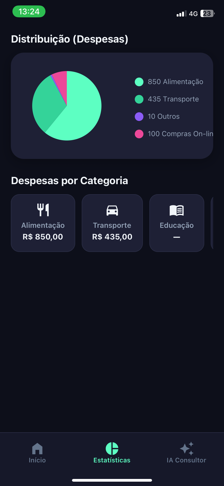

# 🏦 SmartFinance - Consultor Financeiro com IA

O **SmartFinance** é um aplicativo mobile de gestão financeira premium, desenvolvido com **React Native** e **Expo**, que utiliza a inteligência artificial do **Google Gemini** para fornecer insights personalizados sobre seus hábitos de consumo.


---

## 🚀 Funcionalidades Principais

- **📊 Dashboard Inteligente**: Visualize seu saldo, receitas e despesas de forma clara e elegante.
- **🤖 Consultor IA**: Um chat integrado com o Google Gemini que analisa seu histórico real de transações para dar dicas de economia e análise de perfil.
- **📈 Gráficos de Gastos**: Distribuição percentual de despesas por categoria para facilitar a tomada de decisão.
- **📱 UX Premium**: Interface em modo escuro (Dark Mode) com suporte total a **Safe Area** para dispositivos iOS (iPhones com notch).
- **💾 Persistência Local**: Seus dados ficam salvos no dispositivo usando `AsyncStorage`, garantindo privacidade e funcionamento offline.

---

## 🛠️ Tecnologias Utilizadas

- **Core**: [React Native](https://reactnative.dev/) + [Expo](https://expo.dev/)
- **Navegação**: [React Navigation](https://reactnavigation.org/) (Bottom Tabs)
- **IA**: [Google Gemini Pro API](https://ai.google.dev/)
- **Gráficos**: [React Native Chart Kit](https://github.com/indiespirit/react-native-chart-kit)
- **Segurança**: Variáveis de ambiente com `expo-env` (.env)
- **Ícones**: Material Community Icons

---

## ⚙️ Como Executar o Projeto

1. **Clone o repositório**:
   ```bash
   git clone https://github.com/seu-usuario/smartfinance-app.git
   cd smartfinance-app
   ```

2. **Instale as dependências**:
   ```bash
   npm install
   ```

3. **Configure a API do Gemini**:
   - Crie uma chave em [Google AI Studio](https://aistudio.google.com/).
   - Renomeie o arquivo `.env.example` para `.env`.
   - Adicione sua chave na variável `EXPO_PUBLIC_GEMINI_API_KEY`.

4. **Inicie o servidor do Expo**:
   ```bash
   npx expo start
   ```

---

## 🔒 Segurança e Melhores Práticas

Este projeto segue padrões rigorosos de segurança para portifólio:
- **Zero Hardcoded Keys**: Todas as chaves de API são gerenciadas via variáveis de ambiente.
- **Git Hygiene**: O arquivo `.gitignore` está configurado para não subir segredos, `node_modules` ou pastas de build.
- **Clean Code**: Comentários explicativos focados na lógica de negócio e escolha de padrões (Rationale-Focused).

---

## 📄 Licença

Este projeto é para fins de estudo e portfólio. Sinta-se à vontade para clonar e aprender!

---

---

## 🤝 Conecte-se comigo!

Desenvolvido por **Marco Aurelio Leal** 🚀

[](www.linkedin.com/in/marco-aurelio-leal-1a3156180)
[](https://github.com/marcoaurelioleal-AI)

## 📱 Screenshots

<div align="center">
  
  
  
  
</div>